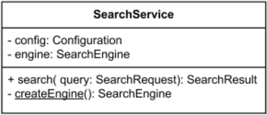
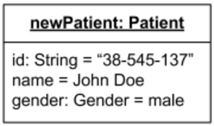
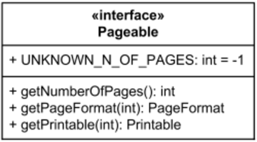
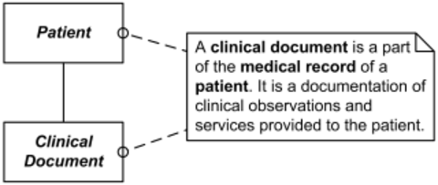
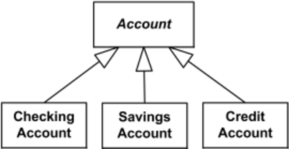
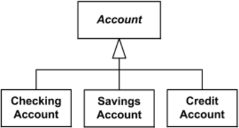

# Elaboración de diagramas de clases

Diapositivas: http://jamj2000.github.io/entornosdesarrollo/5/diapositivas#/  
Actividades: http://jamj2000.github.io/entornosdesarrollo/5/actividades

## Índice
--- 
### Introducción
### UML
### **Diagramas de clases**
### Diagramas de paquetes
### Diagramas de componentes
### Diagramas de implementación
### Software

## Introducción

En esta Unidad aprenderemos a:

- Identificar las herramientas para la elaboración de diagramas de clases.
- Interpretar el significado de diagramas de clases.
- Generar código a partir de un diagrama de clases.
- Generar un diagrama de clases mediante ingeniería inversa.

## UML

**Lenguaje de modelado unificado**

- Es un lenguaje visual de propósito general para representar **modelos**.
- Pretende proporcionar una forma estándar de representar el diseño de un sistema.
- Dispone de numerosos tipos de diagramas.
- Cada tipo de diagrama muestra un aspecto diferente del modelo.
- Actualmente disponible la versión 2.5. Existen algunas diferencias respecto a las versiones 1.x.

###  UML: Tipos de diagramas (I)

- **diagramas de estructura** (aspecto estático)
- **diagramas de comportamiento** (aspecto dinámico)

### UML: Tipos de diagramas (II)

### UML: Diagramas de estructura

Los más utilizados son:

- Diagramas de clases
- Diagramas de paquetes
- Diagramas de componentes
- Diagramas de implementación

## Diagramas de clases

### Clases

### Objetos

### Interfaces

### Relaciones

- Asociación
    - Agregación
    - Composición
- Dependencia
- Generalización
- Realización

#### Asociación

#### Agregación

#### Composición

#### Dependencia

#### Generalización (herencia)

#### Realización (implementación de interfaces)

### Ejemplos

#### Karts

#### Videojuego

#### Colegio

#### Zoo

## Diagramas de paquetes

## Diagramas de componentes

## Diagramas de implementación (deployment)

## Software

- Enterprise Architect
- Visual Paradigm
- Microsoft Visio
- Dia, ArgoUML, Umbrello
- Plugins para Netbeans (**easyUML**, plantUML)
- Plugins para Eclipse (...)
- Plugins para IntellJ Idea (...)
- [Lista exhaustiva](https://en.wikipedia.org/wiki/List_of_Unified_Modeling_Language_tools)

